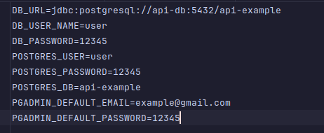

## Ejemplo de API Spring con Docker

Este proyecto es para tener un servicio API dockerizado por lo que facilitaría su deploy en un servidor.

**NOTA** Es importante que antes de correr el docker compose, debes usar maven para crear la carpeta target y el archivo
.jar, de lo contrario, no funcionará.

## Cómo usar

### Antes de correr docker

Debes tener instalado en tu máquina la JVM en su versión 22, ya que esta se usó para la creación de este proyecto, así
evitarás conflictos.

Correr los siguientes comandos
```mvn clean install```

Esto creará el archivo .jar necesario para ejecutar la aplicación con Docker

### correr con docker

**NOTA** Debes crear un archivo .env usando de ejemplo en archivo envExample para nombrar las variables necesarias para
levantar tu entorno.


Una vez generado el archivo .jar, ya puedes correr el siguiente comando:

```
docker compose up
```

Esto creará los contenedores necesarios para levantar la aplicación.

## Tabla necesaria para la correcta ejecución

Para poder que funcione el CRUD de esta API, incluí un pequeño archivo SQL que crea una tabla products y añade 10
productos por defecto para que puedas hacer pruebas.

Esta se añade a nuestra base de datos usando la propiedad `docker-entrypoint-initdb.d` de docker para ejecutar el script
al inicializar.

```postgresql
-- init.sql
CREATE TABLE IF NOT EXISTS products
(
    name
                VARCHAR(100),
    description TEXT,
    id          serial
        CONSTRAINT id PRIMARY KEY
);

-- Insertar 10 datos en la tabla products
INSERT INTO products (name, description)
VALUES ('Producto 1', 'Descripción del producto 1'),
       ('Producto 2', 'Descripción del producto 2'),
       ('Producto 3', 'Descripción del producto 3'),
       ('Producto 4', 'Descripción del producto 4'),
       ('Producto 5', 'Descripción del producto 5'),
       ('Producto 6', 'Descripción del producto 6'),
       ('Producto 7', 'Descripción del producto 7'),
       ('Producto 8', 'Descripción del producto 8'),
       ('Producto 9', 'Descripción del producto 9'),
       ('Producto 10', 'Descripción del producto 10');

```

De esta forma no tendrás conflictos con los datos que le mandas a la base de datos desde la API.

puedes ver las acciones que puedes realizar con una documentación explicativa accediendo a la ui de swagger:

http://localhost:8080/swagger-ui/index.html#/

Espero te sirva!
[Twitter](https://x.com/AngieMatiz6) -
[LinkedIn](https://www.linkedin.com/in/angie-matiz/)